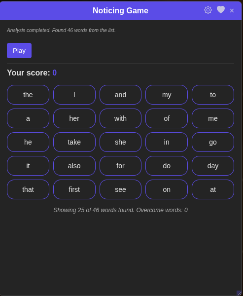
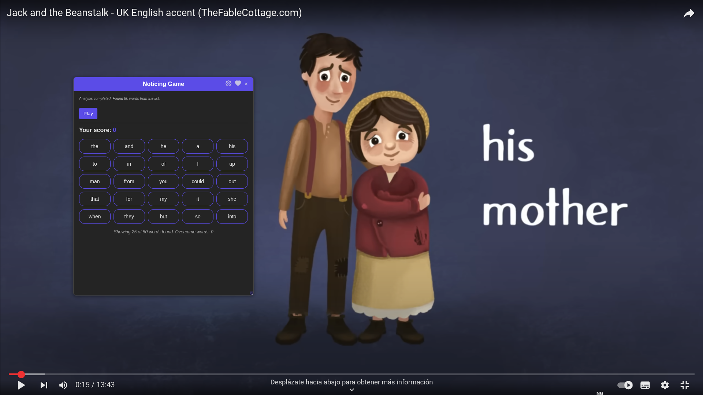

# Noticing Game

**The game interface:**



## Description

**Noticing Game** is an innovative browser extension that transforms YouTube into an interactive language learning tool. It automatically analyzes video subtitles in real time, highlights words from customizable frequency lists, and turns vocabulary practice into a fun, engaging game.
Whether you're a language learner, teacher, or simply curious about the vocabulary used in videos, Noticing Game helps you notice, track, and master the most important words as you watch.

- Instantly see which frequent words appear in any video
- Play by clicking words as you notice them in the subtitles
- Track your progress and challenge yourself to improve

Unlock a new way to learn languages—directly on YouTube!



---

## How It Works

Noticing Game consists of two parts:

1. **Chrome Extension:**
   Provides the interactive game and analyzes subtitles on YouTube.

2. **Backend Subtitle Server:**
   A small Python server that extracts subtitles from YouTube videos using `yt-dlp` and provides them to the extension.

> **Note:** The backend server is required for full functionality.
> For installation and advanced usage, see [`backend/README.md`](backend/README.md) and [`backend/README_BUILD.md`](backend/README_BUILD.md).

---

## Quick Start

### 1. Install and Run the Backend Server

- Download or build the backend (see backend README for details).
- Install dependencies and run:
  ```bash
  cd backend
  pip install -r requirements.txt
  python subtitle_server.py
  ```
- The server should run at `http://localhost:5000`.

**Desktop App Example:**


---

### 2. Install the Extension

- Clone this repository.
- Go to `chrome://extensions/` in Chrome.
- Enable "Developer mode".
- Click "Load unpacked" and select this project folder.

---

### 3. Play the Game

1. Open a YouTube video with subtitles.
2. Click the extension icon and then "Noticing Game".
3. Play by clicking words as you notice them in the video.

---

## Features

- Real-time subtitle analysis on YouTube
- Detects and displays frequent words from your chosen list
- Customizable frequency word lists
- Default list of common English words
- Desktop backend app for easy server management

---

## Requirements

- YouTube video with subtitles
- Backend server running locally (see above)
- Chrome browser

---

## Troubleshooting

- If you see a message about the "Subtitle Server" not running, make sure you have started the backend.
- For backend/server issues, see [`backend/README.md`](backend/README.md).

---

## More Information

- **Backend installation, configuration, packaging, and advanced options:**
  See [`backend/README.md`](backend/README.md) and [`backend/README_BUILD.md`](backend/README_BUILD.md).

---

## License

This project is licensed under the GNU General Public License v3.0 (GPL-3.0).
See [GNU GPL v3.0](https://www.gnu.org/licenses/gpl-3.0.en.html) for details.

---

## About

- Add-on Version: 0.3.2
- Backend Server Version: 0.1.0
- Developed by: Rafael Hernandez Bustamante
- Contact: www.linkedin.com/in/rafaelhernandezbustamante
- Project: https://github.com/Rudull
