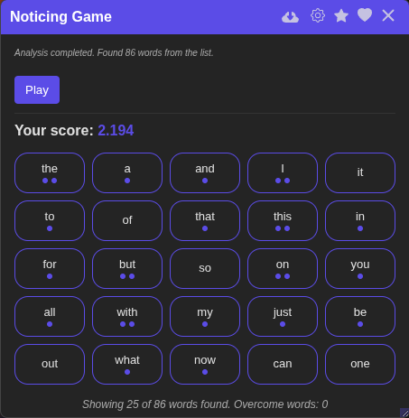
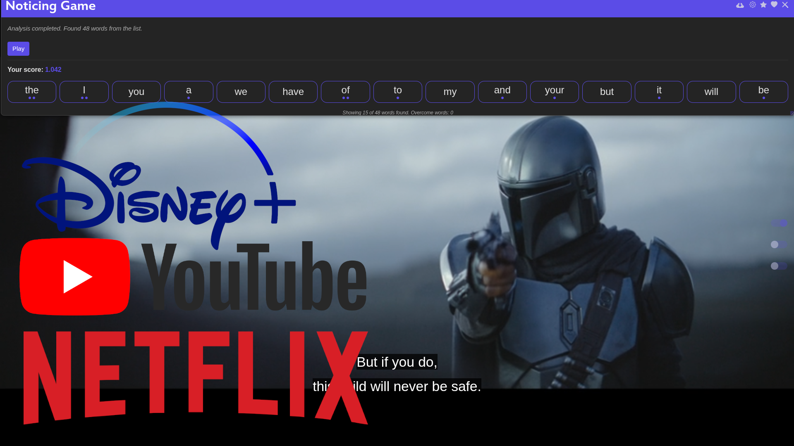
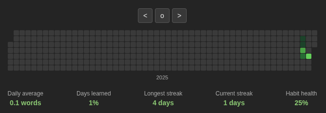
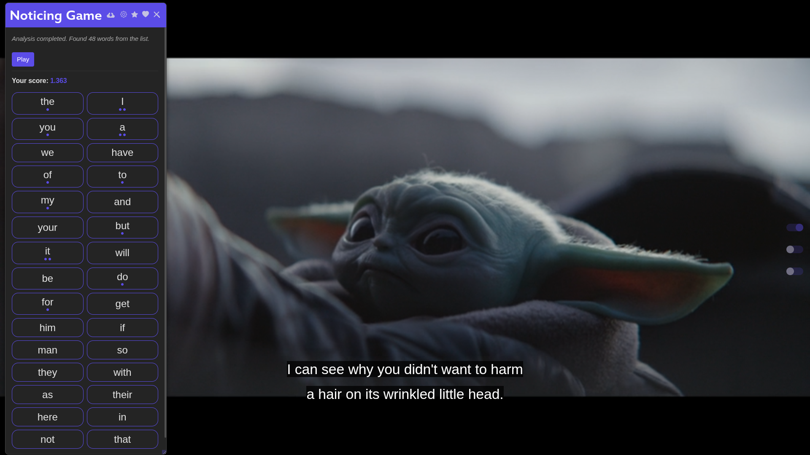
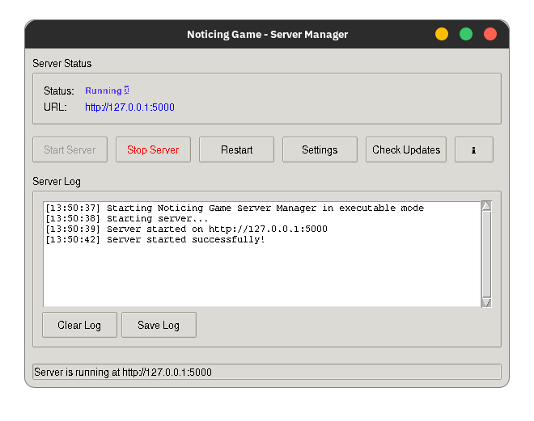
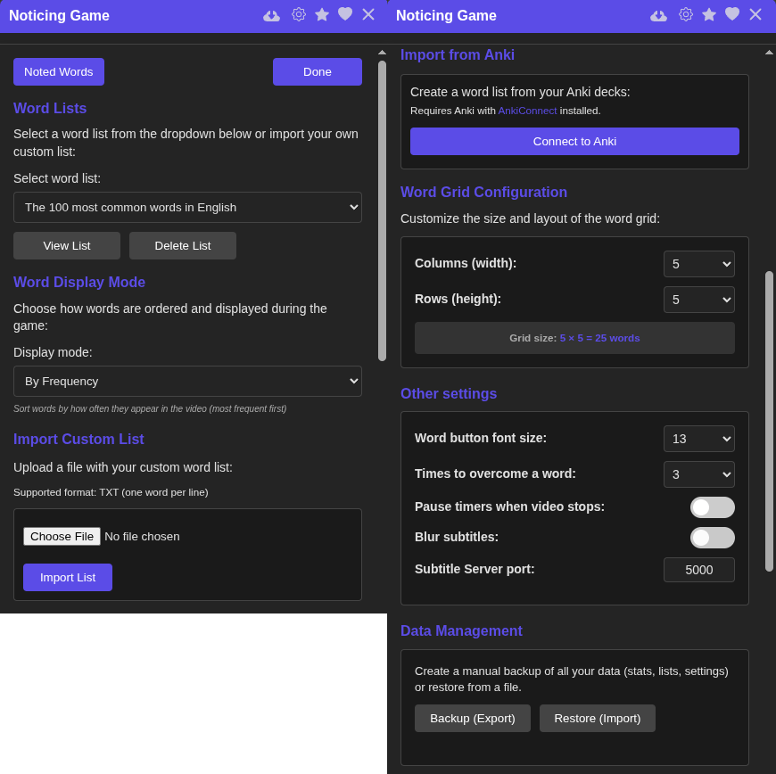

# Noticing Game

**The game interface:**



## Description

**Noticing Game** is an innovative browser extension that transforms **YouTube, Netflix, and Disney+** into an interactive language learning tool. It automatically analyzes video subtitles in real time, highlights words from customizable frequency lists, and turns vocabulary practice into a fun, engaging game.



Whether you're a language learner, teacher, or simply curious about the vocabulary used in videos, Noticing Game helps you notice, track, and master the most important words as you watch.
It is compatible with **any Chromium-based browser**, including Google Chrome, Microsoft Edge, Brave, Opera, and Vivaldi.


- **Gamification:** Track your daily streaks, visualize your learning with a Github-style heatmap, and earn points.
- **Cross-Device Sync:** Create an account to synchronize your progress, streaks, and configurations across multiple devices.
- **Smart Detection:** identifies phrasal verbs and multi-word expressions.
- **Robustness:** Works even when the backend server is offline using a smart fallback mechanism.



Unlock a new way to learn languages—directly directly in your favorite streaming platforms!



---

## How It Works

Noticing Game consists of two parts:

1. **Chrome Extension:**
   Provides the interactive game, visualizes data, and handles user interaction on YouTube (and other platforms).

2. **Backend Subtitle Server:**
   A local Python server that extracts subtitles using `yt-dlp` to bypass browser restrictions.
   *Includes an automatic update mechanism to keep your executable fresh.*

> **Note:** The backend server is recommended for the best experience but the extension now includes an **Emergency Mode** to extract subtitles directly from the page when the server is unavailable.
> For installation and advanced usage, see [`backend/README.md`](backend/README.md) and [`backend/README_BUILD.md`](backend/README_BUILD.md).

---

## Quick Start

### 👶 Option A: For Standard Users (Recommended)

**1. Install the Extension:**
*   **[Click here to install 'Noticing Game' from the Chrome Web Store](https://chromewebstore.google.com/detail/noticing-game/amdacddmlfphgmclpjhbdhcmnldojlpj)**.
*   Click **"Add to Chrome"** to install.

**2. Run the Backend Server (Required for full features):**

1.  **Download:** Go to the **[Releases page](https://github.com/Rudull/noticing_game/releases)** and get the file for your OS:
    *   **Windows:** `noticing_game_server.exe`
    *   **Linux:** `noticing_game_server` (Ubuntu 22.04+, Debian 12+, Fedora 36+)

2.  **Run the application:**

    *   **🪟 Windows Users:**
        1.  Double-click the file.
        2.  *Security Warning:* If you see "Windows protected your PC", click **More info** > **Run anyway**.

    *   **🐧 Linux Users:**
        1.  **Grant Permissions:** Before running, you must make the file executable.
            *   *GUI:* Right-click file → Properties → Permissions → Check **"Allow executing file as program"**.
            *   *Terminal:* Run `chmod +x noticing_game_server`.
        2.  **Run:** Double-click the file or run `./noticing_game_server` in terminal.
        3.  *Compatibility:* If it doesn't run on your specific distro, please use **Option B** (Source Code) below.

3.  **Final Step:**
    *   **Network Access:** On first run, valid **"Allow"** if your Firewall asks.
    *   Look for the **violet circle icon** in your system tray indicating the server is active.

---

### 👨‍💻 Option B: For Developers (Source Code)

#### 1. Install and Run the Backend Server (Python)

- Clone the repository.
- Install dependencies and run:
  ```bash
  cd backend
  pip install -r requirements.txt
  python subtitle_server.py
  ```
- The server should run at `http://localhost:5000`.

**Desktop App Example:**



#### 2. Install the Extension

- Go to `chrome://extensions/`.
- Enable "Developer mode".
- Click "Load unpacked" and select the `src/chrome` folder from this project.

---

### 3. Play the Game

1. Open a YouTube, Netflix or Disney+ video with subtitles (we recommend using **Language Reactor** for better control).
2. Click the extension icon and then "Noticing Game".
3. Log in (optional) to sync your progress.
4. Play by clicking words as you notice them in the video.
   > **Pro Tip:** Use a pop-up dictionary extension (like *Read Pronunciation*) to translate words instantly!

---

## Features

- **Real-time subtitle analysis** on YouTube, Netflix, and Disney+.
- **Gamified Learning**: Daily streaks, activity heatmaps, and progress tracking.
- **Listening Mode**: Blur subtitles to challenge your listening skills.
- **Cloud Sync**: Save your stats and settings to the cloud (requires login).
- **Manual Backups**: Easy export/import of all your game data via JSON.
- **Phrasal Verb Detection**: Smartly identifies multi-word expressions.
- **Flashcard Integration**: Refined integration with Anki.
- **Fullscreen Support**: UI persists and adapts when watching in fullscreen.
- **Emergency Mode**: Fallback subtitle extraction when the backend is offline.
- **Customizable Lists**: Use default frequency lists or import your own.
- **Desktop Backend App**: Easy server management with auto-updates.



---

## 🛠️ Recommended Setup

For a complete immersive learning environment, we highly recommend using **Noticing Game** alongside:

- **[Language Reactor](https://www.languagereactor.com/):**
  Adds powerful controls like seeking by subtitle (A/S/D keys), auto-pause, and repetition.
- **Interactive Dictionaries:**
  Extensions like *Read Pronunciation* or *Google Translate* allow you to get instant definitions/translations by clicking words.

**Why?** This combination gives you full control over the video playback and comprehension, while Noticing Game gamifies your vocabulary acquisition.

---

## Requirements

- YouTube, Netflix, or Disney+ video with subtitles
- Backend server running locally
- **Any Chromium-based browser** (Google Chrome, Microsoft Edge, Brave, Opera, Vivaldi, etc.)

---

## Troubleshooting

- If you see a "Server Offline" message, the extension will attempt to use **Emergency Mode** to fetch subtitles directly from the page.
- For backend/server issues, see [`backend/README.md`](backend/README.md).

---

## More Information

- **Backend installation, configuration, packaging, and advanced options:**
  See [`backend/README.md`](backend/README.md) and [`backend/README_BUILD.md`](backend/README_BUILD.md).

---

## License

This project is licensed under the GNU General Public License v3.0 (GPL-3.0).
See [GNU GPL v3.0](https://www.gnu.org/licenses/gpl-3.0.en.html) for details.

---

## About

- Add-on Version: 0.4.3
- Backend Server Version: 0.1.3
- Developed by: Rafael Hernandez Bustamante
- Contact: www.linkedin.com/in/rafaelhernandezbustamante
- Project: https://github.com/Rudull/noticing-game
